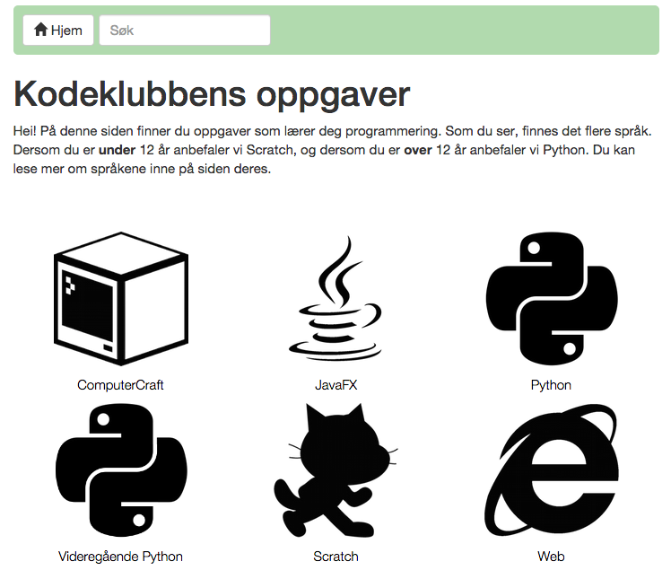

# The codeclub_lesson_builder format
This builder uses a format that is heavily based on the format used by
[Code Club UK][lesson_format]. It is capable of building lessons intended for
the Code Club UK's builder, but there are some differences. The main
differences are related to meta data, and in general we require less meta data
than the UK builder.

[lesson_format]: https://github.com/codeclub/lesson_format

Let's start with an example:
<pre>
---
title: An example Markdown File
level: 1
---

# Introduction {.intro}

Here we are including code:
```blocks
when FLAG clicked
move 10 steps
```
</pre>


## src-directory file structure
By default the builder will look for files in `../src` such that the builder
can be easily added to existing projects by cloning this repo into the
lesson-project. This turns the focus on the lessons (git clone lessons-repo)
rather than the builder, as the builder is less important from the
lesson-contributor's point of view.

This behavior can be changed in [config.js](config.js).

### Courses
The builder will make an index with courses as the main entry point:



The source for the index is directories in the `src` folder. The course
directory should contain `index.md`, `logo-black.png` and `logo-white.png`. If
`src/course/logo-...` is not found, it will fallback to `/src/logo-...`. You can
find generic black and white logos in [images].


## Markdown
We use [CommonMark](http://commonmark.org/) variant of markdown with inline
HTML and [linkify](https://github.com/markdown-it/markdown-it#init-with-presets-and-options)
enabled. Extra plugins in use are:
- [attrs](https://github.com/arve0/markdown-it-attrs)
- [header sections](https://github.com/arve0/markdown-it-header-sections)
- [implicit figures](https://github.com/arve0/markdown-it-implicit-figures)

You can easily learn markdown by [following this tutorial](http://eherrera.net/markdowntutorial/).


## YAML header
Lessons need to provide some basic meta data in the form of a
[YAML header][wp-yaml]. The header should be added to the beginning of the
lesson's markdown file. `---` signify the beginning and end of the header. Note
that [lesson_format][lesson_format] uses `...` for the YAML-ending. You will
find tools for converting `...` to `---` in [utils](utils).

Example:
```
---
title: Title for this lesson
level: 1
---
```
Some attributes in the header are required, and some optional. Read on!

[wp-yaml]: http://en.wikipedia.org/wiki/YAML
[lesson_format]: https://github.com/codeclub/lesson_format

### YAML types
Data types in use are these:
- *String:* Start with character or `"`. Examples:
    - `author: Arve Seljebu`
    - `license: "[CC BY 4.0](http://creativecommons.org/licenses/by/4.0/)"`
- *Number:* Start with an integer. May use `.` for floats.
    - Example: `level: 1`
- *Bool:* `true` or `false`.
    - Example: `indexed: false`

Lists is currently not used, but is easily mistaken with markdown links which
have similar syntax.
- *List:* Start with character `[`, ends with `]`.
    - Example: `fruits: [apple, orange, banana]`

### Required attributes
- **title** (*string*) : Name of the lesson.
- **level** (*number*) : Difficulty of the lesson. Positive integer.
    - 1: Intro - no skills needed
    - 2: Easy - can open editor, use few concepts
    - 3: Medium - combines several concepts
    - 4: Hard - required to be rigid and structured

### Optional attributes:
- **author** (*string with optional markdown*) : The lesson's author. If string
  starts with `[` (markdown links), use `"` to force type string
  (instead of list).
    - Example: `author: "[Arve Seljebu](http://arve0.github.io)"`

- **external** (*string*) : URL to external resource. Nice for adding external
  lessons to index:

    ```
    ---
    title: An external lesson
    level: 3
    external: http://domain.org/path/lesson.html
    ---
    ```

- **footer** (*string with optional markdown*) : Add text to the footer.

- **indexed** (*bool*) : If `false`, hides lesson from index. Nice for lessons
  that only makes sense when along with others.

- **language** (*string*) : Language the lesson is written in. Should be an
  [IETF language tag] which is a combination of language ([ISO-639-1]) and
  region ([ISO-3166-1]).
  Examples:
  - `language: nb-NO` is language Norwegian bokmål, region Norway.
  - `language: en-GB` is language English, region Great Britain.

- **license** (*string with optional markdown*) : If another license then
  CC-BY-SA-4.0 is wanted for the content, specify this in the license tag.

- **translator** (*string with optional markdown*) : Translator of lesson if translated from another
  language.


[IETF language tag]: http://en.wikipedia.org/wiki/IETF_language_tag
[ISO-639-1]: http://en.wikipedia.org/wiki/ISO_639-1
[ISO-3166-1]: http://en.wikipedia.org/wiki/ISO_3166-1


## Using styles
Classes can be added to the generated HTML tags by using the following syntax:
`# Some header {.classname}`
Adding classes can be used to determine the appearance of the generated HTML.
It's possible to define your own classes in the [stylesheets](styles), however
we recommend using the predefined classes listed below.

### Predefined classes
Each lesson begins with an introduction,
- Mark up introduction headers `# Intro {.intro}` (always a h1)

Each lesson is broken down into steps
- Mark up steps with `# Step 1 {.activity}` (always a h1)

Each step has a series of activities, in a list.
- Before each list, use a subheader `## Activity checklist {.check}` (always a h2)

Each step can have things to optionally try.
- Use `## Things to try {.try}` (always h2)

Each step can have challenges too.
- Use `## Challenge {.challenge}` (always a h2)

A note to save:
- Use `## Save Your Project {.save}` (always a h2)

A note to test:
- Use `## Test Your Project {.flag}` (always a h2)

A tip:
- Use `## Heads up! {.tip}` (always a h2). The alias `.protip` also exists,
  for compatibility with legacy lesson_format.


## Styled code
Specify the programming language after <code>```</code> to get syntax
highlighting:

<pre>
```python
for i in range(10):
```
</pre>

### Scratchblocks

We use the [scratchblocks2] library to render scratch blocks. Scratch
blocks inside lessons must follow [the syntax set out here][sb-syntax]. We use
`blocks` to denote a scratch block in markdown:

<pre>
Some paragraph

```blocks
when FLAG clicked
    move 10 steps
```

Another paragraph
</pre>

[scratchblocks2]: https://github.com/blob8108/scratchblocks2
[sb-syntax]: http://wiki.scratch.mit.edu/wiki/Block_Plugin/Syntax
